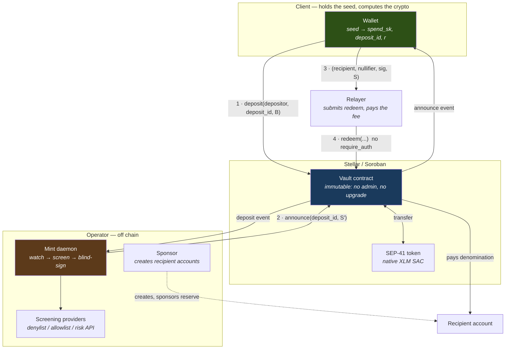
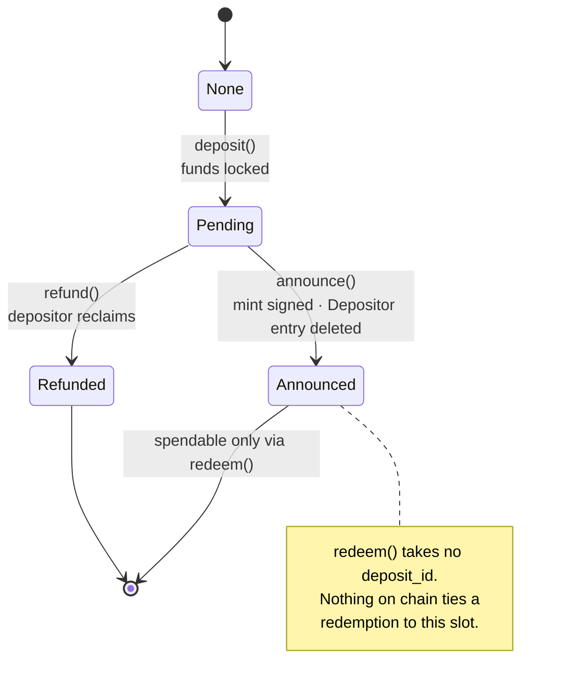
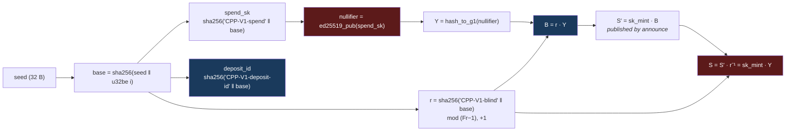

# Architecture

`cpp` is a fixed-denomination Soroban vault. You deposit one denomination under
a public `deposit_id`, and later withdraw that denomination to an unrelated
address under a public `nullifier`. Nothing published on chain connects the two,
while the operator still screens every depositor at the entrance.

The primitive is a **Chaum blind signature over BLS12-381**. There is no ZK
circuit, no trusted setup, and no Merkle tree — the unlinkability comes from the
mint signing a *blinded* point it cannot unblind.

---

## Components



The dashed edge is the one that is easy to get wrong: **the sponsor creates the
recipient account, not the depositor.** Whoever creates a Stellar account is
recorded on it permanently, so a depositor-created recipient publishes exactly
the link the blind signature removes.

---

## The lifecycle

```mermaid
sequenceDiagram
    autonumber
    participant W as Wallet (browser)
    participant D as Depositor account
    participant V as Vault contract
    participant M as Mint daemon
    participant S as Sponsor
    participant R as Relayer
    participant Rec as Recipient

    Note over W: base = sha256(seed ‖ u32be(i))<br/>spend_sk, deposit_id, r ← domain-separated
    Note over W: nullifier = ed25519_pub(spend_sk)<br/>Y = H(nullifier),  B = r·Y

    W->>D: build deposit tx
    D->>V: deposit(depositor, deposit_id, B)
    Note right of V: require_auth(depositor)<br/>status → Pending<br/>store Depositor(deposit_id)
    V-->>M: deposit event (deposit_id, B)

    M->>V: read Depositor(deposit_id)
    Note over M: screen the address<br/>unanimous-allow, stop at first deny
    alt allowed
        M->>V: announce(deposit_id, S′ = sk·B)
        Note right of V: require_auth(mint_authority)<br/>status → Announced<br/><b>delete Depositor entry</b>
        V-->>W: announce event (deposit_id, S′)
    else denied
        Note over M: no announce; depositor may refund
        D->>V: refund(deposit_id)
    end

    Note over W: S = S′ · r⁻¹   (the mint never sees S)
    Note over W: verify e(S, −G2)·e(H(nullifier), PK) == 1

    S->>Rec: begin/create_account(0)/end sponsorship
    Note over W: msg = "CPP-V1-REDEEM" ‖ xdr(vault) ‖ xdr(recipient)<br/>sig = ed25519_sign(spend_sk, msg)
    W->>R: (recipient, nullifier, sig, S)
    R->>V: redeem(recipient, nullifier, sig, S)
    Note right of V: <b>no require_auth</b><br/>1 ed25519_verify(nullifier, msg, sig)<br/>2 nullifier unspent → burn it<br/>3 pairing check<br/>4 transfer
    V->>Rec: one denomination
    V-->>R: redeem event (nullifier, recipient)
```

Steps 1–2 and steps 10–13 are the two halves of a token's life. An observer sees
both halves and cannot join them: doing so requires `r`, which never leaves the
client.

---

## Deposit slot state machine

Each `deposit_id` moves through this once. There is no path back to `Pending`,
and no path from `Refunded` or `Announced` to anywhere.



`redeem` deliberately has no edge on this diagram. It consumes a **nullifier**,
not a deposit slot — the two namespaces never meet on chain, which is the
unlinkability stated as a data-model property rather than a promise.

---

## Who knows what

The security argument is mostly about what each party is *unable* to do.

| | Sees deposit | Sees redemption | Can link them | Can steal | Can refuse |
|---|---|---|---|---|---|
| **Mint** | yes — address, `deposit_id`, `B` | yes (public) | **no** — needs `r` | no | **yes** |
| **Relayer** | no | yes — `recipient`, `nullifier` | no | no — recipient is signed | yes (delay only) |
| **Sponsor** | no | recipient address only | no | no | yes |
| **Chain observer** | yes | yes | no | no | no |
| **Wallet holder** | yes | yes | yes | — | — |

Three of these deserve spelling out:

- **The mint cannot forge.** `announce` publishes `S′ = sk·B`. The vault pays
  only against an `S` that pairs with `PK` over `H(nullifier)`. A mint that
  signs garbage produces a token nobody can spend, itself included.
- **The mint cannot link.** It signs `B = r·Y` and never sees `Y`. This is not
  a policy commitment — it is arithmetic the operator cannot invert.
- **The relayer cannot redirect.** The recipient is bound into the signed
  message, so a relayer that rewrites it invalidates the signature. It can
  refuse to submit, and it learns `recipient ↔ nullifier ↔ your IP`.

The one power the design *grants* is refusal, and that is the compliance gate.
`refund` bounds it: a depositor the mint declines to sign for reclaims their
funds.

---

## Cryptographic construction



Blue is public at deposit time; red is public at redemption time. The blinding
factor `r` is the only bridge, and it stays in the wallet.

Verification on chain is a single pairing check:

```
e(S, −G2) · e(H(nullifier), PK) == 1
```

`r` cancels because `S = S′·r⁻¹ = sk·r·Y·r⁻¹ = sk·Y`, so the signature the vault
verifies is over a point the mint never handled.

### Shared constants

These are duplicated in `contracts/vault/src/crypto.rs` and `ts/src/crypto.ts`
and **must agree byte for byte**. Nothing in either build catches divergence —
only the generated parity vectors in `contracts/vault/src/vectors.rs` do.

| | |
|---|---|
| Hash-to-G1 DST | `CPP-V1-CS01-with-BLS12381G1_XMD:SHA-256_SSWU_RO_` |
| Redeem domain | `CPP-V1-REDEEM` |
| G1 encoding | uncompressed, `be(X) ‖ be(Y)` — 96 bytes |
| G2 encoding | uncompressed, `be(X_c1) ‖ be(X_c0) ‖ be(Y_c1) ‖ be(Y_c0)` — 192 bytes |
| Signed message | `CPP-V1-REDEEM ‖ xdr(vault) ‖ xdr(recipient)` |

Binding the **vault** into the message stops a signature harvested from one
vault being replayed against another sharing the same mint key. Binding the
**recipient** stops a watcher lifting the redemption out of the mempool and
redirecting it.

---

## Storage layout

| Key | Durability | Lifetime |
|---|---|---|
| `Config` | instance | extended on every touch |
| `Deposit(deposit_id)` | persistent | set at `deposit`, updated at `announce`/`refund` |
| `Depositor(deposit_id)` | persistent | **deleted by `announce`** |
| `Nullifier(nullifier)` | persistent | written at `redeem`, extended on every touch |

Two entries carry the design:

`Depositor` is deleted by `announce`. It exists only so the mint can learn who
to screen — deliberately kept out of the event log, and removed from state once
it has served that purpose. After announce, the chain no longer records which
account funded which slot.

`Nullifier` entries are persistent and extended on every touch, so they survive
archival. That durability *is* the double-spend guard: an expired nullifier
would be a re-spendable token.

---

## Reading the contract's own guarantees

Four invariants are load-bearing. Changing any of them breaks the security
argument rather than merely the tests.

1. **`redeem` takes no `require_auth`.** The Ed25519 spend signature carries the
   entire right to spend, so any relayer can submit and pay. Adding an auth
   check would make the fee payer the link that blinding removes.
2. **The caller never supplies `Y`.** The contract always derives it from the
   nullifier. A caller-supplied `Y` would let anyone pair an arbitrary point
   against the mint key.
3. **State changes precede transfers.** `refund` and `redeem` flip status / burn
   the nullifier *before* transferring, so a re-entrant token contract cannot
   drain the vault.
4. **The vault is immutable.** No admin, no upgrade. Rotating the mint key or
   the denomination means deploying a new vault — which is also why the mint
   refuses to start against a vault whose `mint_pk` does not match its seed.

---

## Known limits

Stated here because they are properties of the design, not defects to be fixed
later.

- **Fixed denomination.** One vault, one amount. Varying amounts would leak the
  link that blinding removes.
- **The anonymity set is the mint's signing history.** A young or quiet pool
  offers little cover: two deposits and two redemptions minutes apart pair up by
  timing regardless of the cryptography. This is the user's to manage, and a
  frontend should say so out loud.
- **The mint is a trusted issuer of value.** It cannot steal or de-anonymise,
  but it can mint against a vault it did not fund. Splitting the key across
  signers is the obvious hardening and is not implemented.
- **Non-native assets are not fully supported.** A vault denominated in a
  non-native asset would need a sponsored trustline on each recipient before it
  could be paid. Only account creation is implemented.

See [`frontend-integration.md`](./frontend-integration.md) for how to build
against all of this.
